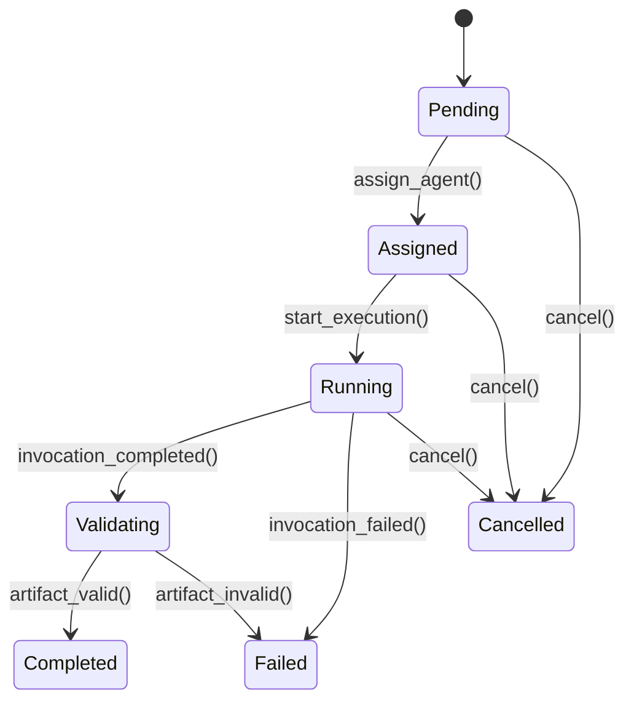
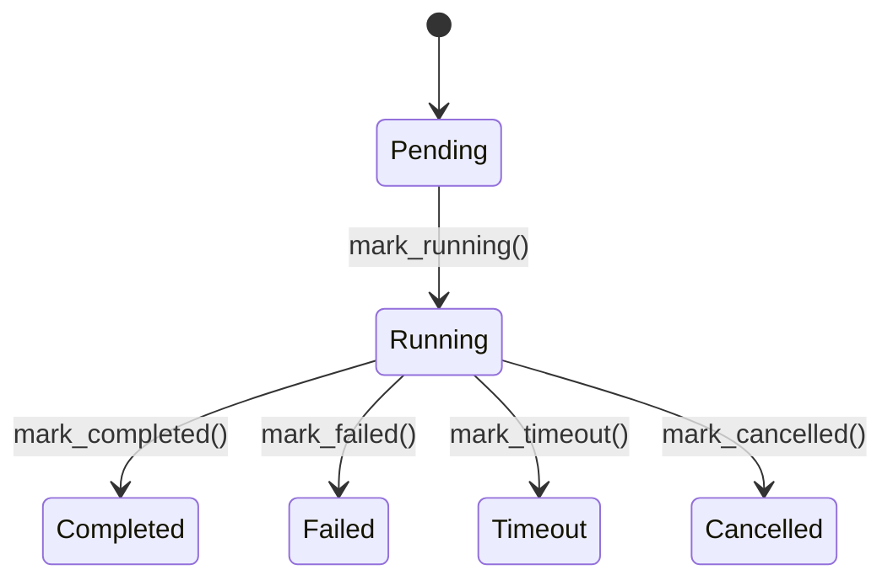
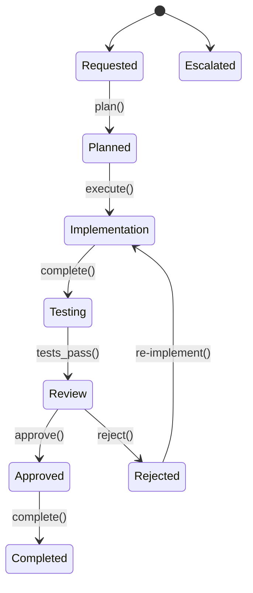

# Domain Model

## Aggregate Ownership and Transactional Boundaries

Each aggregate root owns its invariants and is updated transactionally. Cross-aggregate changes use eventual consistency via domain events.

## Core Aggregates

### TeamDefinition Aggregate (Configuration)

```
TeamDefinition
├── roles: list[RoleRef]
├── agent_bindings: list[AgentBinding]
├── policies: list[PolicyRef]
├── budget: BudgetLimits
└── environment: EnvironmentConfig
```

**Lifecycle**: Draft → Validating → Published → Deprecated → Retired

**Invariants**:
- All referenced roles must exist and be Published
- All agent_bindings must reference valid AgentDefinitions
- Budget limits must be non-negative

### RoleDefinition Aggregate (Configuration)

```
RoleDefinition
├── responsibility: str
├── inputs: list[ContractRef]
├── outputs: list[ContractRef]
├── allowed_actions: list[str]
├── quality_criteria: QualityCriteria
└── required_capabilities: list[CapabilityRequirement]
```

**Lifecycle**: Draft → Validating → Published → Deprecated

**Invariants**:
- All output contracts must be Published
- Required capabilities must be testable (have associated test tasks)

**Capability Matching** (Mistral):

```yaml
CapabilityMatching:
  algorithm: weighted_scoring
  factors:
    skill_match: 0.5
    language_match: 0.3
    tool_availability: 0.2
  thresholds:
    minimum_score: 0.7
    fallback: human_assignment
```

### AgentDefinition Aggregate (Configuration)

```
AgentDefinition
├── adapter_type: AdapterType (CLI/MCP/API)
├── adapter_config: AdapterConfig
├── capabilities: list[Capability]
├── resource_profile: ResourceLimits
├── security_profile: SecurityProfile
└── health_status: HealthStatus
```

**Lifecycle**: Draft → Validating → Published → Deprecated

**Invariants**:
- If sandbox_required=true, network must be limited or none
- All capabilities must have valid skill names
- Adapter config must match adapter_type

### ContractDefinition Aggregate (Configuration)

```
ContractDefinition
├── schema: SchemaDocument (JSON/YAML Schema)
├── version: ContractVersion (MAJOR.MINOR.PATCH)
├── compatibility_policy: CompatibilityRule
└── validation_rules: list[ValidationRule]
```

**Lifecycle**: Draft → Validating → Published → Deprecated

**Invariants**:
- Schema must be valid JSON Schema or YAML Schema
- Version must follow SemVer
- N-1 minor version compatibility must be maintained

### Task Aggregate (Execution)

```
Task (Aggregate Root)
├── objective: str
├── assigned_role: str
├── inputs: list[ArtifactRef]
├── expected_outputs: list[ContractType]
├── constraints: dict
├── assignment: Assignment
├── cost_budget: CostBudget
├── status: TaskStatus
├── attempts: int
└── metadata: TaskMetadata
```

**Value Objects**:

```
Assignment
├── role_name: str
├── assigned_agent_id: UUID
└── assigned_at: datetime

CostBudget
├── max_tokens: int | None
└── max_usd: float | None
```

**Lifecycle**: Pending → Assigned → Running → Validating → Completed / Failed / Cancelled

**Invariants**:
- Must have Assignment before Running state
- Cost budget must not be exceeded during execution
- Expected outputs must have valid ContractDefinitions

### AgentInvocation Aggregate (Execution)

```
AgentInvocation (Aggregate Root)
├── task_id: UUID
├── agent_definition_id: UUID
├── contract_type: str
├── contract_version: str
├── status: InvocationStatus
├── resource_usage: ResourceUsage
├── error_details: ErrorDetails
└── output_artifact_id: UUID | None
```

**Lifecycle**: Pending → Running → Completed / Failed / Timeout / Cancelled

**Invariants**:
- Must reference valid Task and AgentDefinition
- Resource usage only recorded after completion
- Output artifact must exist if Completed

### Workspace Aggregate (Execution)

```
Workspace (Aggregate Root)
├── repo_url: str
├── branch: str
├── workdir: str
├── git_state: GitState
├── ephemeral: bool
└── sandbox_id: UUID | None
```

**Lifecycle**: Created → Active → Cleaned

**Invariants**:
- Must be valid git repository with branch access
- Workdir must be isolated from other workspaces
- Sandbox must exist if isolation is required

---

## Entity Relationship Diagram

```
TeamDefinition 1 ──→ * RoleDefinition
TeamDefinition 1 ──→ * AgentDefinition
TeamDefinition 1 ──→ * WorkflowDefinition

RoleDefinition ──→ * Capability (referenced)
AgentDefinition ──→ * Capability (declared)

Task 1 ──→ 1 Workspace
Task 1 ──→ 1..* AgentInvocation (for retries)
Task ──→ * Artifact (outputs)

WorkflowInstance 1 ──→ * Task
WorkflowInstance ──→ * Approval (Phase 2)
```

---

## State Machines

### Task States



### AgentInvocation States



### WorkflowInstance States (Phase 2)



---

## Addressing Audit Concerns

### TaskExecution vs AgentInvocation (All)

**Decision**: AgentInvocation is the sole runtime execution entity. Task tracks orchestration state (attempts, assignment). This resolves the overlap concern.

### Workspace Ownership (GLM)

Workspace is its own aggregate root, not owned by Task. Security Context interacts with Workspace via its public interface, maintaining DDD boundaries.

### Capability Matching (Mistral, Kimi)

Capability matching uses weighted scoring with clear thresholds. See CapabilityMatching configuration above.

### Retry Policy Clarity (Minimax)

Retry uses the same Workspace for failed attempts (preserves partial progress). Maximum attempts enforced by Task aggregate.