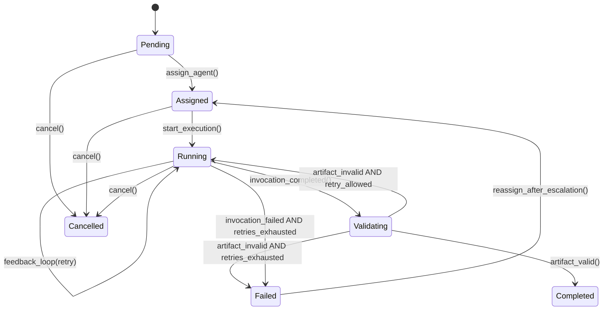
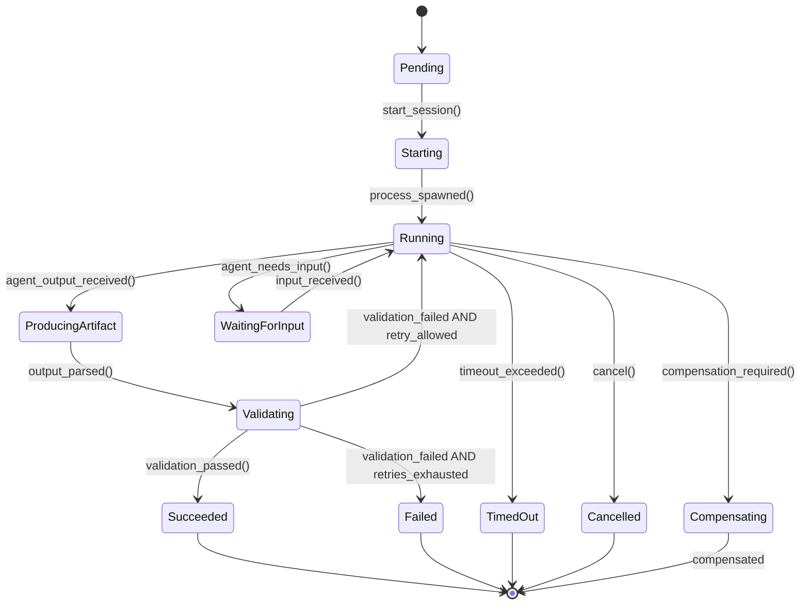
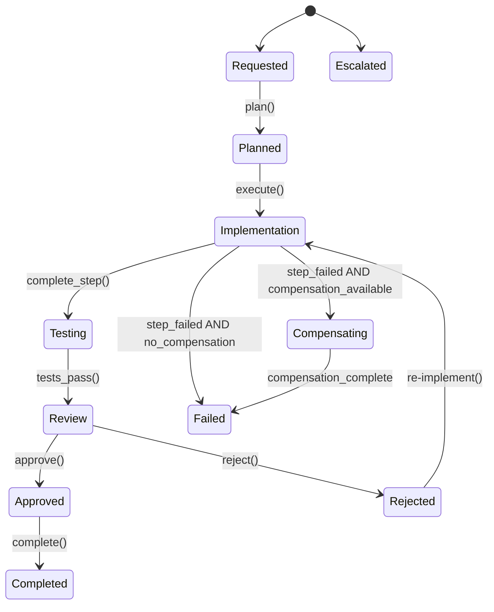

# Domain Model

## Aggregate Ownership and Transactional Boundaries

Each aggregate root owns its invariants and is updated transactionally. Cross-aggregate changes use eventual consistency via domain events. Idempotency keys prevent duplicate side effects on retry.

### Ownership Rules

| Aggregate | Owner Context | Invariants |
|-----------|---------------|------------|
| TeamDefinition | Configuration | All referenced roles must exist and be Published |
| RoleDefinition | Configuration | All output contracts must be Published |
| AgentDefinition | Configuration | If sandbox_required=true, network must be limited |
| ContractDefinition | Configuration | Schema must be valid, N-1 compatibility maintained |
| Task | Execution | Must have Assignment before Running; cost budget structurally required |
| AgentSession | Execution | Central runtime aggregate; one Task, one Workspace, one attempt |
| Workspace | Execution | Exactly one AgentSession; Task may own many workspaces (retries) |
| WorkflowInstance | Workflow | State transitions must follow WorkflowDefinition |
| Artifact | Execution | Must have valid provenance; checksum integrity; observation method |

### Execution-First Aggregate Model

**AgentSession is the central runtime aggregate.** Configuration contracts (Role, Agent, Team) describe *what may run*; AgentSession records *what ran*. AgentInvocation is a request DTO that creates a session — it is not an aggregate root. Cost accounting, validation, checkpoints, and workspace observation all hang off the session.

### Cross-Aggregate Consistency

- **Task → AgentSession**: Task emits `Task.Assigned` with MatchingDecision; new AgentSession + Workspace created per attempt
- **AgentSession → Artifact**: AgentSession emits `Artifact.Produced` after OutputParser + workspace reconciliation
- **WorkflowInstance → Task**: Workflow emits `Task.Created`; Task created via event handler
- **AgentSession → CostRecord**: Authoritative CostRecord owned by Observability; session holds `cost_record_id` + live meters
- **Workflow compensation → durable effects**: Compensation targets commit/branch/PR/artifact IDs recorded on Workspace.durable_effects, never the cleaned ephemeral filesystem

### Idempotency Protocol

All mutable operations require an idempotency key. Stored with operation outcome to prevent duplicate side effects.

```yaml
IdempotencyKey:
  type: object
  required: [key, operation_type, outcome]
  properties:
    key:
      type: string
      description: "Client-provided or derived idempotency key"
    operation_type:
      type: string
      description: "Type of operation (e.g., Task.Create, Artifact.Produce)"
    outcome:
      type: object
      description: "Stored result of the operation"
    created_at:
      type: string
      format: date-time
    expires_at:
      type: string
      format: date-time
```

Key derivation:
- Task creation: `SHA256(team_id + objective + role + timestamp_bucket)`
- AgentSession: `SHA256(task_id + attempt_number)`
- Artifact production: `SHA256(session_id + contract_type + checksum)`

---

## Core Aggregates

### TeamDefinition Aggregate (Configuration)

```
TeamDefinition
├── roles: list[RoleRef]
├── agent_bindings: list[AgentBinding]
├── policies: list[PolicyRef]
├── budget: BudgetLimits
└── scoring_weights: ScoringWeights
```

**Lifecycle**: Draft → Validating → Published → Deprecated → Retired

**Invariants**:
- All referenced roles must exist and be Published
- All agent_bindings must reference valid AgentDefinitions
- Budget limits must be non-negative
- Scoring weights must sum to 1.0

### RoleDefinition Aggregate (Configuration)

```
RoleDefinition
├── responsibility: str
├── inputs: list[ContractRef]
├── outputs: list[ContractRef]
├── allowed_actions: list[str]
├── quality_criteria: QualityCriteria
├── required_capabilities: list[CapabilityRequirement]
└── prompt_template_ref: str  # Reference to prompt template
```

**Lifecycle**: Draft → Validating → Published → Deprecated

**Invariants**:
- All output contracts must be Published
- Required capabilities must be testable
- Prompt template must exist if referenced

### AgentDefinition Aggregate (Configuration)

```
AgentDefinition
├── adapter_type: AdapterType
├── adapter_config: AdapterConfig
├── capabilities: list[Capability]
├── resource_profile: ResourceLimits
├── security_profile: SecurityProfile
├── supported_output_modes: list[OutputMode]
├── max_retry_attempts: int  # Default: 3
└── health_status: HealthStatus
```

**Lifecycle**: Draft → Validating → Published → Deprecated

**Invariants**:
- If sandbox_required=true, network must be limited to proxy
- All capabilities must have valid skill names
- supported_output_modes must not be empty
- max_retry_attempts must be >= 1

### ContractDefinition Aggregate (Configuration)

```
ContractDefinition
├── schema: SchemaDocument
├── version: ContractVersion
├── compatibility_policy: CompatibilityRule
├── validation_rules: list[ValidationRule]
└── semantic_validators: list[ValidatorRef]  # NEW
```

**Lifecycle**: Draft → Validating → Published → Deprecated

**Invariants**:
- Schema must be valid JSON/YAML Schema
- Version must follow SemVer
- N-1 minor version compatibility maintained
- Semantic validators must have timeout and budget

### Task Aggregate (Execution)

```
Task (Aggregate Root)
├── id: UUID
├── idempotency_key: str  # NEW
├── objective: str
├── assigned_role: str
├── inputs: list[ArtifactRef]
├── expected_outputs: list[ContractType]
├── constraints: dict
├── assignment: Assignment
├── cost_budget: CostBudget  # anyOf max_tokens | max_usd REQUIRED
├── status: TaskStatus
├── retry_state: RetryState  # task-scoped attempts — NOT a circuit breaker
├── active_workspace_id: UUID | None
├── matching_decision_id: UUID | None
└── metadata: TaskMetadata
```

**Lifecycle**: Pending → Assigned → Running → Validating → Completed / Failed / Cancelled

**Invariants**:
- Must have Assignment before Running
- `cost_budget` must include at least one of `max_tokens` or `max_usd`
- Cost budget must not be exceeded
- Expected outputs must have valid ContractDefinitions
- `retry_state.attempts` must not exceed `retry_policy.max_attempts`
- Agent circuit breaker lives on AgentScorecard only (never on Task)

### AgentSession Aggregate (Execution) — Central Runtime Unit

```
AgentSession (Aggregate Root)
├── session_id: UUID
├── idempotency_key: str  # SHA256(task_id + attempt_number)
├── task_id: UUID
├── agent_definition_id: UUID
├── matching_decision_id: UUID
├── attempt_number: int
├── previous_session_id: UUID | None
├── status: SessionStatus
├── workspace_id: UUID  # exclusive to this session
├── sandbox_id: UUID
├── sandbox_attestation_id: UUID
├── compiled_prompt_id: UUID
├── cost_lease_id: UUID  # sync hard-kill gate (Observability-owned CostLease)
├── resource_limits: ResourceLimits  # anyOf max_tokens | max_usd REQUIRED
├── recent_checkpoint_ids: list[UUID]  # ring ≤20; full history in events/table
├── tool_calls: list[ToolCall]         # ring ≤50; full history in event stream
├── pending_input: PendingInput | None  # waiting_for_input
├── validation_result_id: UUID | None
├── feedback_artifact: FeedbackArtifact | None  # last feedback only
├── resource_usage: ResourceUsage  # latest snapshot only; not full history
├── cost_record_id: UUID  # authoritative CostRecord ref
└── replay_metadata: ReplayMetadata
```

**Lifecycle**: Pending → Starting → Running → WaitingForInput → ProducingArtifact → Validating → Succeeded / Failed / Compensating / TimedOut / Cancelled

**Invariants**:
- Must belong to exactly one Task
- Owns exactly one Workspace for its lifetime
- attempt_number must be >= 1
- High-frequency data (full tool_calls, full checkpoints, usage history) lives in events/linked stores — not unbounded on the session document
- resource_limits must include at least one cost ceiling
- Live resource_usage must not exceed resource_limits (sidecar enforces via CostLease)

### Workspace Aggregate (Execution)

```
Workspace (Aggregate Root)
├── workspace_id: UUID
├── task_id: UUID  # parent; many workspaces per task across retries
├── session_id: UUID  # exclusive owner (1:1 with AgentSession)
├── repo_url: str
├── branch: str
├── workdir: str
├── status: WorkspaceStatus  # created | active | observed | cleaned | failed
├── ephemeral: bool
├── sandbox_id: UUID | None
├── baseline_commit: str
├── current_commit: str
├── baseline_tree_hash: str
├── durable_effects: DurableEffects  # survive cleanup; used by compensation
└── security_context: WorkspaceSecurityContext
```

**Lifecycle**: Created → Active → Observed → Cleaned

**Invariants**:
- session_id must reference exactly one AgentSession
- Task 1 → 1..* Workspace (one new workspace per retry attempt)
- baseline_commit / baseline_tree_hash set before agent execution
- current_commit updated after observation
- Ephemeral filesystem may be cleaned while durable_effects remain for saga compensation
- Security Context enforces SandboxPolicy at creation; does not own the Workspace

### Artifact Aggregate (Execution)

```
Artifact (Aggregate Root)
├── id: UUID
├── idempotency_key: str  # NEW
├── contract_type: str
├── contract_version: str
├── content: dict
├── provenance: ArtifactProvenance
├── checksum: str
├── derived_from: list[UUID]  # NEW: lineage
├── supersedes: UUID | None  # NEW: lineage
└── observation_method: str  # NEW: how artifact was derived
```

**Lifecycle**: Produced → Validated → Accepted / Rejected

**Invariants**:
- checksum must match content SHA256
- provenance must reference valid task and agent
- observation_method must be one of: workspace_diff, parser_extracted, agent_claims, synthesized

### WorkflowInstance Aggregate (Workflow)

```
WorkflowInstance (Aggregate Root)
├── id: UUID
├── definition_id: UUID
├── team_id: UUID
├── current_state: str
├── compensation_stack: list[CompensationAction]  # NEW
├── step_results: list[StepResult]  # NEW
├── state_data: dict
├── created_at: datetime
└── updated_at: datetime
```

**Lifecycle**: Requested → Planned → Implementation → Testing → Review → Approved → Completed / Failed / Cancelled / Escalated

**Invariants**:
- State transitions must follow WorkflowDefinition
- compensation_stack must have entry for each completed step
- step_results must be ordered by sequence

---

## Entity Relationship Diagram

```
TeamDefinition 1 ──→ * RoleDefinition
TeamDefinition 1 ──→ * AgentDefinition
TeamDefinition 1 ──→ * WorkflowDefinition

RoleDefinition ──→ * Capability (referenced)
AgentDefinition ──→ * Capability (declared)
AgentDefinition ──→ AgentScorecard (derived)

Task 1 ──→ 1..* AgentSession (one session per attempt)
Task 1 ──→ 1..* Workspace (via AgentSession; one workspace per attempt)
Task ──→ * Artifact (outputs)
Task ──→ RetryState (task-scoped attempt bookkeeping)

AgentSession 1 ──→ 1 Workspace
AgentSession ──→ * Checkpoint
AgentSession ──→ * ToolCall
AgentSession ──→ 1 CompiledPrompt
AgentSession ──→ ValidationResult
AgentSession ──→ FeedbackArtifact
AgentSession ──→ CostRecord (by id; Observability owns payload)
AgentSession ──→ SandboxAttestation
AgentSession ──→ MatchingDecision (selection audit)

AgentScorecard ──→ CircuitBreakerState  # ONLY place circuit breaker lives

Artifact ──→ * Artifact (lineage via derived_from)

WorkflowInstance 1 ──→ * Task
WorkflowInstance ──→ * Approval
WorkflowInstance ──→ * CompensationAction (abstract; maps to durable_effects)
```

---

## State Machines

### Task States



### AgentSession States



### WorkflowInstance States



---

## Capability Matching

### Composition Order (Hard Filter → Score → Negotiate)

Assignment is a three-stage pipeline. Contract negotiation is **not** a scoring dimension.

```
1. Hard filters (boolean eliminate)
   - circuit_breaker.state == open  → reject
   - missing required tools/skills → reject
   - health_status unhealthy       → reject
   - network/sandbox constraints   → reject
   - budget_infeasible estimate    → reject

2. Multi-dimensional score (rank survivors)

3. negotiate_contract() top-down
   - If top-ranked agent is contract-incompatible → try next
   - If none compatible → assignment fails
```

See `docs/contract/compatibility.md` for full `assign_agent()` pseudocode.

### Multi-Dimensional Scoring

Subjective `proficiency` enums are prohibited. Routing uses objective constraints and historical metrics:

```python
def score_agent(
    agent: AgentDefinition,
    task: Task,
    context: ExecutionContext,
    history: AgentScorecard
) -> MatchingDecision:
    weights = context.scoring_weights or DEFAULT_WEIGHTS
    history = warm_start_scorecard(agent, history)  # carry metrics across agent versions

    scores = {
        "skill_match": compute_skill_match(agent, task),
        "language_match": compute_language_match(agent, task),
        "tool_match": compute_tool_match(agent, task),
        "historical_success": history.success_rate if history else 0.5,
        "cost_efficiency": compute_cost_efficiency(agent, history),
        "latency": compute_latency_score(agent, history),
        "availability": check_availability(agent)
    }
    
    total = sum(scores[d] * weights[d] for d in scores)

    # Open circuit breakers are hard-filtered earlier; half_open gets a soft penalty
    if history and history.circuit_breaker.state == "half_open":
        total *= 0.5

    staleness = history.staleness_seconds if history else None
    
    return MatchingDecision(
        selected_agent_id=agent.id,
        score=total,
        dimension_scores=scores,
        explanation=generate_explanation(scores, weights),
        projected_cost_usd=estimate_cost(agent, task),
        projected_latency_seconds=estimate_latency(agent, task, history),
        scorecard_staleness_seconds=staleness,
        scorecard_warm_start=history.warm_started if history else False,
    )
```

### Scorecard Version Warm-Start

When an `AgentDefinition` publishes a new version, the scorecard **inherits** rolling metrics from the previous version of the same agent name (marked `warm_start=true`) until the new version accumulates its own history. Cold-start default `historical_success=0.5` applies only to brand-new agents.

### Skill Matching

Hierarchical skill taxonomy with dot notation:

```yaml
Skill:
  type: object
  properties:
    skill:
      type: string
      pattern: "^[a-z][a-z0-9-\\.]*$"
      examples:
        - "code.generate.python.fastapi"
        - "code.review.security"
        - "testing.integration"
    version:
      type: string
    output_contracts:
      type: array
      items:
        type: string
    required_tools:
      type: array
      items:
        type: string
    eval_suite_ref:
      type: string
      description: "Reference to evaluation suite for this skill"
```

### Default Scoring Weights

```yaml
ScoringWeights:
  skill_match: 0.30
  language_match: 0.15
  tool_match: 0.10
  historical_success: 0.20
  cost_efficiency: 0.10
  latency: 0.05
  availability: 0.10
```

---

## Retry Policy

### Session-Level Retry

- Each retry creates a **new AgentSession** with `attempt_number` incremented
- `previous_session_id` links to prior attempt for audit trail
- Each attempt gets a **new Workspace** (Task 1 → 1..* Workspace)
- Prior workspaces transition to `cleaned` after observation; durable_effects retained
- FeedbackArtifact injected into PromptCompiler for next attempt

### Circuit Breaker (Agent-Scoped Only)

Circuit breakers live **only** on `AgentScorecard` (Observability read model). Tasks carry `retry_state` for attempt bookkeeping; they do **not** host a circuit breaker.

```yaml
CircuitBreakerState:  # on AgentScorecard
  type: object
  properties:
    state:
      type: string
      enum: [closed, open, half_open]
    consecutive_failures:
      type: integer
    failure_threshold:
      type: integer
      default: 5
    last_failure_at:
      type: string
      format: date-time
    recovery_timeout_seconds:
      type: integer
      default: 300
```

Behavior:
- **Closed**: Normal operation. Failures counted across tasks for that agent.
- **Open**: Agent quarantined. Hard filter rejects assignment. After recovery_timeout → half_open.
- **Half_open**: One probe task allowed. Success → closed. Failure → open.
- Scorecard update lag is a known limitation under burst load; hard filter still rejects agents whose last known state is `open`.

### Workflow-Level Compensation

Compensation targets **durable side effects**, not ephemeral Workspace filesystems (which are usually already cleaned when a later step fails).

Two-layer model:
1. **Abstract** (Workflow Context): `rollback_workspace_effects`, `delete_artifacts`, `revoke_access`, `notify`, `custom`
2. **Concrete** (Execution Context): resolved at step completion into `git_revert`, `branch_delete`, `pr_close`, etc. against `Workspace.durable_effects`

```yaml
CompensationAction:
  type: object
  required: [action_type, target_ref]
  properties:
    action_type:
      type: string
      enum: [rollback_workspace_effects, delete_artifacts, revoke_access, notify, custom]
    target_ref:
      type: string
      description: "task_id or step_id whose durable_effects are compensated"
    concrete_actions:
      type: array
      items:
        type: object
        properties:
          effect_type:
            type: string
            enum: [git_revert, branch_delete, pr_close, resource_cleanup, artifact_delete]
          target:
            type: string
            description: "Commit SHA, branch name, PR number, or artifact id"
    executed_at:
      type: string
      format: date-time
```

On workflow failure, compensation executes in reverse order (LIFO) against durable targets.

