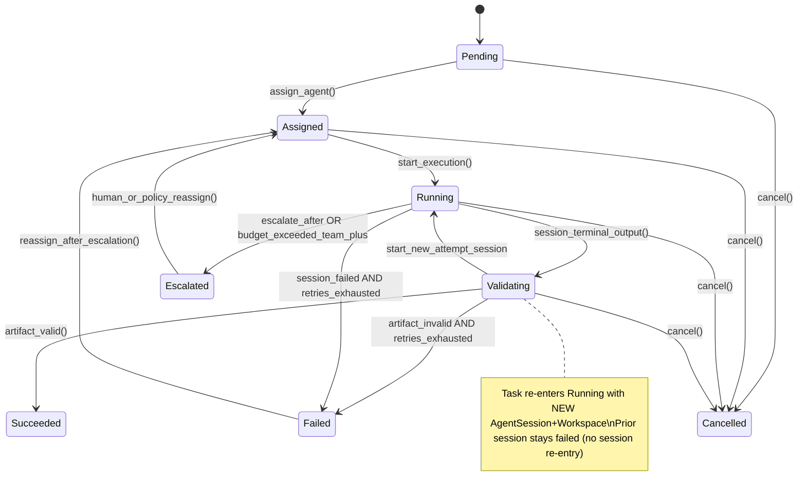
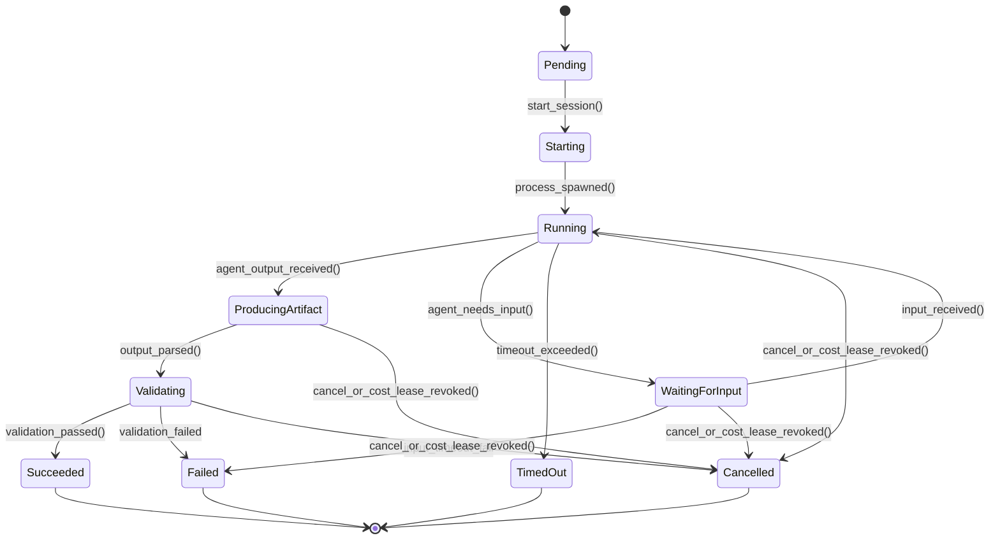
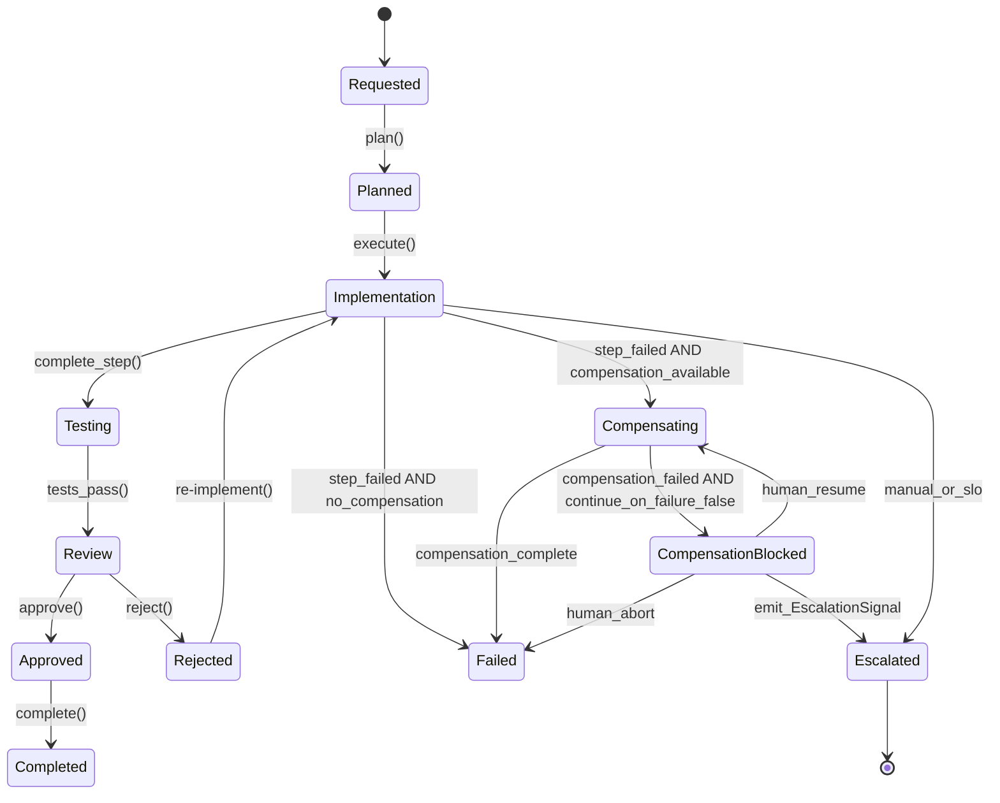

# Domain Model

## Aggregate Ownership and Transactional Boundaries

Each aggregate root owns its invariants and is updated transactionally. Cross-aggregate changes use eventual consistency via domain events. Idempotency keys prevent duplicate side effects on retry.

### Ownership Rules

| Aggregate | Owner Context | Invariants |
|-----------|---------------|------------|
| TeamDefinition | Configuration | All referenced roles must exist and be Published |
| RoleDefinition | Configuration | All output contracts must be Published |
| AgentDefinition | Configuration | If sandbox_required=true, network must be limited |
| ContractDefinition | Configuration | Schema must be valid, N-1 compatibility maintained |
| Task | Execution | Must have Assignment before Running; cost budget structurally required |
| AgentSession | Execution | Central runtime aggregate; one Task, one Workspace, one attempt |
| Workspace | Execution | Exactly one AgentSession; Task may own many workspaces (retries) |
| WorkflowInstance | Workflow | State transitions must follow WorkflowDefinition |
| Artifact | Execution | Must have valid provenance; checksum integrity; observation method |

### Execution-First Aggregate Model

**AgentSession is the central runtime aggregate.** Configuration contracts (Role, Agent, Team) describe *what may run*; AgentSession records *what ran*. AgentInvocation is a request DTO that creates a session — it is not an aggregate root. Cost accounting, validation, checkpoints, and workspace observation all hang off the session.

### Cross-Aggregate Consistency

- **Task → AgentSession**: Task emits `Task.Assigned` with MatchingDecision; new AgentSession + Workspace created per attempt
- **AgentSession → Artifact**: AgentSession emits `Artifact.Produced` after OutputParser + workspace reconciliation
- **WorkflowInstance → Task**: Workflow emits `Task.Created`; Task created via event handler
- **AgentSession → CostRecord**: Authoritative CostRecord owned by Observability; session holds `cost_record_id` + live meters
- **Workflow compensation → durable effects**: Compensation targets commit/branch/PR/artifact IDs recorded on Workspace.durable_effects, never the cleaned ephemeral filesystem

### Idempotency Protocol

All mutable operations require an idempotency key. Stored with operation outcome to prevent duplicate side effects.


> **Contract:** [`docs/contract/schemas/eventing/idempotency-key.schema.yaml`](../contract/schemas/eventing/idempotency-key.schema.yaml)


Key derivation:
- Task creation: `SHA256(team_id + objective + role + timestamp_bucket)`
- AgentSession: `SHA256(task_id + attempt_number)`
- Artifact production: `SHA256(session_id + contract_type + checksum)`

---

## Core Aggregates

### TeamDefinition Aggregate (Configuration)

> **Contract:** [`docs/contract/schemas/team/team.schema.yaml`](../contract/schemas/team/team.schema.yaml)

**Lifecycle**: Draft → Validating → Published → Deprecated → Retired

**Invariants**:
- All referenced roles must exist and be Published
- All agent_bindings must reference valid AgentDefinitions
- Budget limits must be non-negative
- Scoring weights must sum to 1.0

### RoleDefinition Aggregate (Configuration)

> **Contract:** [`docs/contract/schemas/matching/role.schema.yaml`](../contract/schemas/matching/role.schema.yaml)

**Lifecycle**: Draft → Validating → Published → Deprecated

**Invariants**:
- All output contracts must be Published
- Required capabilities must be testable
- Prompt template must exist if referenced

### AgentDefinition Aggregate (Configuration)

> **Contract:** [`docs/contract/schemas/execution/agent.schema.yaml`](../contract/schemas/execution/agent.schema.yaml)

**Lifecycle**: Draft → Validating → Published → Deprecated

**Invariants**:
- If sandbox_required=true, network must be limited to proxy
- All capabilities must have valid skill names
- supported_output_modes must not be empty
- Retry attempt ceilings live on Task.retry_policy.max_attempts (>= 1), not on AgentDefinition
- adapter_config requirements are conditional on adapter_type (cli→binary_path, api/remote→endpoint, mcp→command)

### ContractDefinition Aggregate (Configuration)

Contract definitions are the versioned schema documents under `docs/contract/schemas/`. Compatibility rules: [`docs/contract/compatibility.md`](../contract/compatibility.md).

**Lifecycle**: Draft → Validating → Published → Deprecated

**Invariants**:
- Schema must be valid JSON/YAML Schema
- Version must follow SemVer
- N-1 minor version compatibility maintained
- Semantic validators must have timeout and budget

### Task Aggregate (Execution)

> **Contract:** [`docs/contract/schemas/execution/task.schema.yaml`](../contract/schemas/execution/task.schema.yaml)

**Lifecycle**: Pending → Assigned → Running → Validating → Succeeded / Failed / Cancelled / Escalated

**Invariants**:
- Must have Assignment before Running
- `matching_decision_id` required when status is `assigned`, `running`, or `validating`
- `retry_state.last_failure_category` required when status is `failed` or `cancelled`
- `cost_budget` must include at least one of `max_tokens` or `max_usd`
- `validation_budget` is **required** and partitioned; enforced via separate CostLease (`budget_pool=validation`)
- Cost budget must not be exceeded
- Expected outputs must have valid ContractDefinitions
- `retry_state.attempts` must not exceed `retry_policy.max_attempts` (incremented in same transaction as AgentSession create)
- Default `retry_on` includes `infrastructure` (transient); excludes `budget_exceeded`
- Agent circuit breaker lives on AgentScorecard only (never on Task); hard-filter reject → `circuit_breaker_open`

### AgentSession Aggregate (Execution) — Central Runtime Unit

> **Contract:** [`docs/contract/schemas/execution/agent-session.schema.yaml`](../contract/schemas/execution/agent-session.schema.yaml)

High-frequency telemetry is **not** stored unbounded on the session document. See checkpoint, tool-call, cost-record, and cost-lease contracts; storage: [`sql/execution.sql`](../contract/sql/execution.sql).

**Lifecycle**: Pending → Starting → Running → WaitingForInput → ProducingArtifact → Validating → Succeeded / Failed / TimedOut / Cancelled

**Note:** Compensation is a WorkflowInstance concern. CostLease revocation → `cancelled` + `last_failure_category=budget_exceeded`. There is no session-level `compensating` status.

**Invariants**:
- Must belong to exactly one Task
- Owns exactly one Workspace for its lifetime (`workspace_id` **required**; session create atomic with workspace create)
- attempt_number must be >= 1
- High-frequency data (full tool_calls, full checkpoints, usage history) lives in events/linked stores — not unbounded on the session document
- `validation_result` and `feedback_artifact` are **IDs only** (never embed full objects)
- resource_limits must include at least one cost ceiling
- `cost_lease_id` required while status ∈ starting/running/waiting_for_input/producing_artifact/validating
- Live resource_usage must not exceed resource_limits (sidecar enforces via CostLease)

### Workspace Aggregate (Execution)

> **Contract:** [`docs/contract/schemas/execution/workspace.schema.yaml`](../contract/schemas/execution/workspace.schema.yaml)

**Lifecycle**: Created → Active → Observed | AutoCommitFailed → Cleaned | Failed

**Invariants**:
- session_id must reference exactly one AgentSession (unique in DDL)
- Task 1 → 1..* Workspace (one new workspace per retry attempt)
- baseline_commit / baseline_tree_hash set before agent execution
- current_commit updated after observation
- **Auto-commit before cleanup**: AgentExecutor MUST ensure durable commit exists and update `durable_effects.head_commit`; effects_log appends incrementally during execution
- Ephemeral filesystem may be cleaned while durable_effects remain for saga compensation
- Security Context evaluates SandboxPolicy (intersection merge) at creation; does not own the Workspace
- `security_context.effective_allowlist_hash` must match the SandboxPolicy evaluation

### Artifact Aggregate (Execution)

> **Contract:** [`docs/contract/schemas/artifact/artifact.schema.yaml`](../contract/schemas/artifact/artifact.schema.yaml)

**Lifecycle**: Produced → Validated → Accepted / Rejected

**Invariants**:
- checksum must match content SHA256
- provenance must reference valid task and agent
- observation_method must be one of: workspace_diff, parser_extracted, agent_claims, synthesized

### WorkflowInstance Aggregate (Workflow)

> **Contracts:**
> - Workflow template: [`orchestration/workflow.schema.yaml`](../contract/schemas/orchestration/workflow.schema.yaml)
> - Compensation: [`orchestration/compensation-action.schema.yaml`](../contract/schemas/orchestration/compensation-action.schema.yaml)
> - Step results: [`orchestration/step-result.schema.yaml`](../contract/schemas/orchestration/step-result.schema.yaml)
> - Storage: [`sql/workflow.sql`](../contract/sql/workflow.sql)

**Lifecycle**: Requested → Planned → Implementation → Testing → Review → Approved → Completed / Failed / Cancelled / Escalated / Compensating / CompensationBlocked / Rejected

**Invariants**:
- State transitions must follow WorkflowDefinition
- compensation_stack (LIFO) must have entry for each completed step (see workflow.schema.yaml)
- step_results must be ordered by sequence
- Approval gates default to `auto_approve=false` (opt-in only)
- `continue_on_compensation_failure=false` default → CompensationBlocked + EscalationSignal with `assigned_to`

---

## Entity Relationship Diagram

```
TeamDefinition 1 ──→ * RoleDefinition
TeamDefinition 1 ──→ * AgentDefinition
TeamDefinition 1 ──→ * WorkflowDefinition

RoleDefinition ──→ * Capability (referenced)
AgentDefinition ──→ * Capability (declared)
AgentDefinition ──→ AgentScorecard (derived)

Task 1 ──→ 1..* AgentSession (one session per attempt)
Task 1 ──→ 1..* Workspace (via AgentSession; one workspace per attempt)
Task ──→ * Artifact (outputs)
Task ──→ RetryState (task-scoped attempt bookkeeping)

AgentSession 1 ──→ 1 Workspace
AgentSession ──→ * Checkpoint
AgentSession ──→ * ToolCall
AgentSession ──→ 1 CompiledPrompt
AgentSession ──→ ValidationResult
AgentSession ──→ FeedbackArtifact
AgentSession ──→ CostRecord (by id; Observability owns payload)
AgentSession ──→ SandboxAttestation
AgentSession ──→ MatchingDecision (selection audit)

AgentScorecard ──→ CircuitBreakerState  # ONLY place circuit breaker lives

Artifact ──→ * Artifact (lineage via derived_from)

WorkflowInstance 1 ──→ * Task
WorkflowInstance ──→ * Approval
WorkflowInstance ──→ * CompensationAction (abstract; maps to durable_effects)
```

---

## State Machines

### Task States



**Retry model (normative):** each validation/retry attempt creates a **new AgentSession** and **new Workspace**. Task stays alive and increments `retry_state.attempts`. Session status never re-enters `running` after `validating` on the same session. Event `Task.Completed` maps to status **`succeeded`**.

### AgentSession States

Compensation is a **WorkflowInstance** concern (durable_effects). AgentSession has no
`compensating` status — CostLease revocation → `Cancelled` + `budget_exceeded`.



**No session re-entry after terminal validating.** On validation failure with retry allowed, Task creates a **new** AgentSession (attempt_number+1); the failed session stays `failed`. No `Correcting` or `Escalated` session statuses (escalation is Task-owned).

### WorkflowInstance States



---

## Capability Matching

### Composition Order (Hard Filter → Score → Negotiate)

Assignment is a three-stage pipeline. Contract negotiation is **not** a scoring dimension.

```
1. Hard filters (boolean eliminate)
   - circuit_breaker.state == open  → reject
   - missing required tools/skills → reject
   - health_status unhealthy       → reject
   - network/sandbox constraints   → reject
   - budget_infeasible estimate    → reject

2. Multi-dimensional score (rank survivors)

3. negotiate_contract() top-down
   - If top-ranked agent is contract-incompatible → try next
   - If none compatible → assignment fails
```

See `docs/contract/compatibility.md` for full `assign_agent()` pseudocode.

### Multi-Dimensional Scoring

Subjective `proficiency` enums are prohibited. Routing uses objective constraints and historical metrics:

```python
def score_agent(
    agent: AgentDefinition,
    task: Task,
    context: ExecutionContext,
    history: AgentScorecard
) -> MatchingDecision:
    weights = context.scoring_weights or DEFAULT_WEIGHTS
    history = warm_start_scorecard(agent, history)  # carry metrics across agent versions

    scores = {
        "skill_match": compute_skill_match(agent, task),
        "language_match": compute_language_match(agent, task),
        "tool_match": compute_tool_match(agent, task),
        "historical_success": history.success_rate if history else 0.5,
        "cost_efficiency": compute_cost_efficiency(agent, history),
        "latency": compute_latency_score(agent, history),
        "availability": check_availability(agent)
    }
    
    total = sum(scores[d] * weights[d] for d in scores)

    # Open circuit breakers are hard-filtered earlier; half_open gets a soft penalty
    if history and history.circuit_breaker.state == "half_open":
        total *= 0.5

    # Cold-start exploration (see agent.md); never bypasses hard filters
    if is_cold_scorecard(history):
        total = min(1.0, total + (context.exploration_bonus or 0.15))

    staleness = history.staleness_seconds if history else None
    
    return MatchingDecision(
        selected_agent_id=agent.id,
        score=total,
        dimension_scores=scores,
        explanation=generate_explanation(scores, weights),
        projected_cost_usd=estimate_cost(agent, task),
        projected_latency_seconds=estimate_latency(agent, task, history),
        scorecard_staleness_seconds=staleness,
        scorecard_warm_start=history.warm_started if history else False,
    )
```

### Scorecard Version Warm-Start

When an `AgentDefinition` publishes a new version, the scorecard **inherits** rolling metrics from the previous version of the same agent name (marked `warm_start=true`) until the new version accumulates its own history. Cold-start default `historical_success=0.5` applies only to brand-new agents.

### Skill Matching

Hierarchical skill taxonomy with dot notation:


> **Contract:** [`docs/contract/schemas/matching/skill.schema.yaml`](../contract/schemas/matching/skill.schema.yaml)


### Default Scoring Weights


> **Contract:** [`docs/contract/schemas/team/team.schema.yaml#scoring_weights`](../contract/schemas/team/team.schema.yaml#scoring_weights)


---

## Retry Policy

### Session-Level Retry

- Each retry creates a **new AgentSession** with `attempt_number` incremented
- `previous_session_id` links to prior attempt for audit trail
- Each attempt gets a **new Workspace** (Task 1 → 1..* Workspace)
- Prior workspaces transition to `cleaned` after observation; durable_effects retained
- FeedbackArtifact injected into PromptCompiler for next attempt

### Circuit Breaker (Agent-Scoped Only)

Circuit breakers live **only** on `AgentScorecard` (Observability read model). Tasks carry `retry_state` for attempt bookkeeping; they do **not** host a circuit breaker.


> **Contract:** structure for `CircuitBreakerState:  # on AgentScorecard` — see `docs/contract/schemas/` (do not redefine fields here).


Behavior:
- **Closed**: Normal operation. Failures counted across tasks for that agent.
- **Open**: Agent quarantined. Hard filter rejects assignment. After recovery_timeout → half_open.
- **Half_open**: One probe task allowed. Success → closed. Failure → open.
- Scorecard update lag is a known limitation under burst load; hard filter still rejects agents whose last known state is `open`.

### Workflow-Level Compensation

Compensation targets **durable side effects**, not ephemeral Workspace filesystems (which are usually already cleaned when a later step fails).

Two-layer model:
1. **Abstract** (Workflow Context): `rollback_workspace_effects`, `delete_artifacts`, `revoke_access`, `notify`, `custom`
2. **Concrete** (Execution Context): resolved at step completion into `git_revert`, `branch_delete`, `pr_close`, etc. against `Workspace.durable_effects`


> **Contract:** [`docs/contract/schemas/orchestration/compensation-action.schema.yaml`](../contract/schemas/orchestration/compensation-action.schema.yaml)


On workflow failure, compensation executes in reverse order (LIFO) against durable targets.

