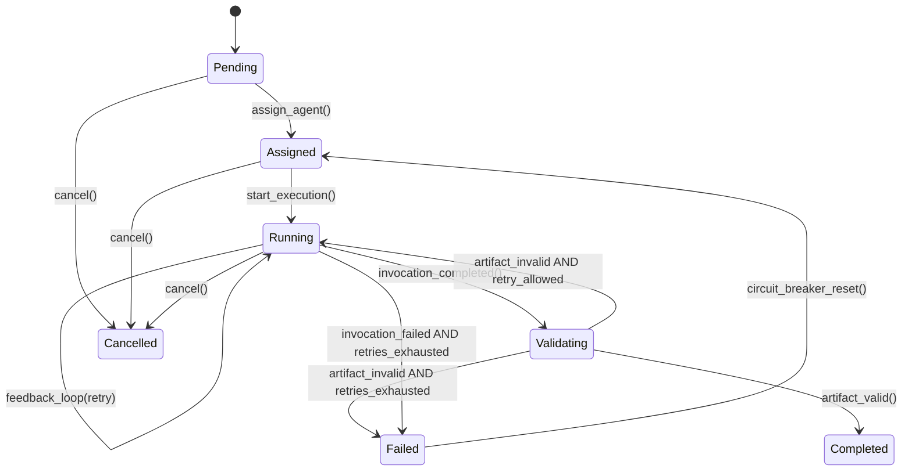
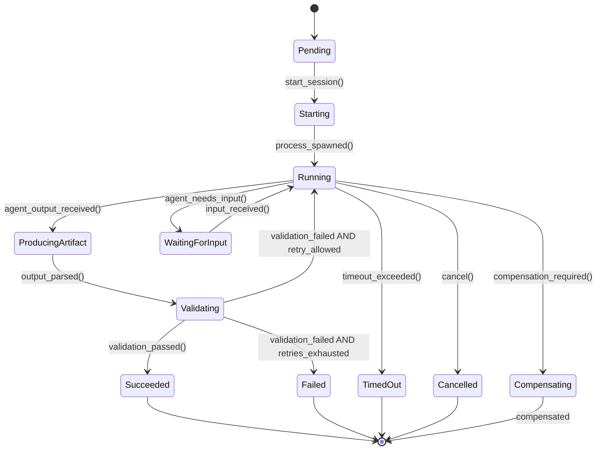
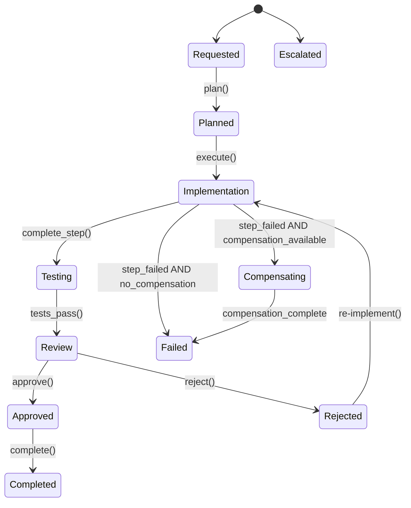

# Domain Model

## Aggregate Ownership and Transactional Boundaries

Each aggregate root owns its invariants and is updated transactionally. Cross-aggregate changes use eventual consistency via domain events. Idempotency keys prevent duplicate side effects on retry.

### Ownership Rules

| Aggregate | Owner Context | Invariants |
|-----------|---------------|------------|
| TeamDefinition | Configuration | All referenced roles must exist and be Published |
| RoleDefinition | Configuration | All output contracts must be Published |
| AgentDefinition | Configuration | If sandbox_required=true, network must be limited |
| ContractDefinition | Configuration | Schema must be valid, N-1 compatibility maintained |
| Task | Execution | Must have Assignment before Running; cost budget enforced |
| AgentSession | Execution | Must belong to exactly one Task; checkpoint integrity |
| Workspace | Execution | Must be assigned to exactly one AgentSession at a time |
| WorkflowInstance | Workflow | State transitions must follow WorkflowDefinition |
| Artifact | Execution | Must have valid provenance; checksum integrity |

### Cross-Aggregate Consistency

- **Task → AgentSession**: Task emits `Task.Assigned` event; AgentSession consumes and creates checkpoint
- **AgentSession → Artifact**: AgentSession emits `Artifact.Produced`; Artifact created in same transaction
- **WorkflowInstance → Task**: Workflow emits `Task.Created`; Task created via event handler
- **AgentSession → CostRecord**: CostRecord emitted on every state transition; eventually consistent with Task

### Idempotency Protocol

All mutable operations require an idempotency key. Stored with operation outcome to prevent duplicate side effects.

```yaml
IdempotencyKey:
  type: object
  required: [key, operation_type, outcome]
  properties:
    key:
      type: string
      description: "Client-provided or derived idempotency key"
    operation_type:
      type: string
      description: "Type of operation (e.g., Task.Create, Artifact.Produce)"
    outcome:
      type: object
      description: "Stored result of the operation"
    created_at:
      type: string
      format: date-time
    expires_at:
      type: string
      format: date-time
```

Key derivation:
- Task creation: `SHA256(team_id + objective + role + timestamp_bucket)`
- AgentSession: `SHA256(task_id + attempt_number)`
- Artifact production: `SHA256(session_id + contract_type + checksum)`

---

## Core Aggregates

### TeamDefinition Aggregate (Configuration)

```
TeamDefinition
├── roles: list[RoleRef]
├── agent_bindings: list[AgentBinding]
├── policies: list[PolicyRef]
├── budget: BudgetLimits
└── scoring_weights: ScoringWeights
```

**Lifecycle**: Draft → Validating → Published → Deprecated → Retired

**Invariants**:
- All referenced roles must exist and be Published
- All agent_bindings must reference valid AgentDefinitions
- Budget limits must be non-negative
- Scoring weights must sum to 1.0

### RoleDefinition Aggregate (Configuration)

```
RoleDefinition
├── responsibility: str
├── inputs: list[ContractRef]
├── outputs: list[ContractRef]
├── allowed_actions: list[str]
├── quality_criteria: QualityCriteria
├── required_capabilities: list[CapabilityRequirement]
└── prompt_template_ref: str  # Reference to prompt template
```

**Lifecycle**: Draft → Validating → Published → Deprecated

**Invariants**:
- All output contracts must be Published
- Required capabilities must be testable
- Prompt template must exist if referenced

### AgentDefinition Aggregate (Configuration)

```
AgentDefinition
├── adapter_type: AdapterType
├── adapter_config: AdapterConfig
├── capabilities: list[Capability]
├── resource_profile: ResourceLimits
├── security_profile: SecurityProfile
├── supported_output_modes: list[OutputMode]
├── max_retry_attempts: int  # Default: 3
└── health_status: HealthStatus
```

**Lifecycle**: Draft → Validating → Published → Deprecated

**Invariants**:
- If sandbox_required=true, network must be limited to proxy
- All capabilities must have valid skill names
- supported_output_modes must not be empty
- max_retry_attempts must be >= 1

### ContractDefinition Aggregate (Configuration)

```
ContractDefinition
├── schema: SchemaDocument
├── version: ContractVersion
├── compatibility_policy: CompatibilityRule
├── validation_rules: list[ValidationRule]
└── semantic_validators: list[ValidatorRef]  # NEW
```

**Lifecycle**: Draft → Validating → Published → Deprecated

**Invariants**:
- Schema must be valid JSON/YAML Schema
- Version must follow SemVer
- N-1 minor version compatibility maintained
- Semantic validators must have timeout and budget

### Task Aggregate (Execution)

```
Task (Aggregate Root)
├── id: UUID
├── idempotency_key: str  # NEW
├── objective: str
├── assigned_role: str
├── inputs: list[ArtifactRef]
├── expected_outputs: list[ContractType]
├── constraints: dict
├── assignment: Assignment
├── cost_budget: CostBudget
├── status: TaskStatus
├── attempts: int
├── max_attempts: int  # Default: 3
├── circuit_breaker: CircuitBreakerState  # NEW
└── metadata: TaskMetadata
```

**Lifecycle**: Pending → Assigned → Running → Validating → Completed / Failed / Cancelled

**Invariants**:
- Must have Assignment before Running
- Cost budget must not be exceeded
- Expected outputs must have valid ContractDefinitions
- attempts must not exceed max_attempts
- circuit_breaker.state == "open" prevents new assignments

### AgentSession Aggregate (Execution)

```
AgentSession (Aggregate Root)
├── session_id: UUID (idempotency key)
├── task_id: UUID
├── agent_definition_id: UUID
├── attempt_number: int
├── previous_session_id: UUID | None
├── status: SessionStatus
├── workspace_id: UUID
├── sandbox_id: UUID
├── compiled_prompt_id: UUID
├── checkpoints: list[Checkpoint]
├── tool_calls: list[ToolCall]
├── partial_outputs: list[PartialOutput]
├── validation_result: ValidationResult | None
├── feedback_artifact: FeedbackArtifact | None
├── resource_usage: ResourceUsage
├── cost_record: CostRecord
└── replay_metadata: ReplayMetadata
```

**Lifecycle**: Pending → Starting → Running → WaitingForInput → ProducingArtifact → Validating → Succeeded / Failed / Compensating / TimedOut / Cancelled

**Invariants**:
- Must belong to exactly one Task
- attempt_number must be >= 1
- Each checkpoint must reference valid session state
- cost_record must not exceed session budget

### Workspace Aggregate (Execution)

```
Workspace (Aggregate Root)
├── id: UUID
├── repo_url: str
├── branch: str
├── workdir: str
├── ephemeral: bool
├── sandbox_id: UUID | None
├── assigned_session_id: UUID | None  # NEW
├── baseline_commit: str  # NEW: git HEAD before agent execution
├── current_commit: str  # NEW: git HEAD after agent execution
└── security_context: WorkspaceSecurityContext
```

**Lifecycle**: Created → Active → Observed → Cleaned

**Invariants**:
- assigned_session_id must reference a valid AgentSession
- baseline_commit must be set before agent execution
- current_commit updated after agent execution completes

### Artifact Aggregate (Execution)

```
Artifact (Aggregate Root)
├── id: UUID
├── idempotency_key: str  # NEW
├── contract_type: str
├── contract_version: str
├── content: dict
├── provenance: ArtifactProvenance
├── checksum: str
├── derived_from: list[UUID]  # NEW: lineage
├── supersedes: UUID | None  # NEW: lineage
└── observation_method: str  # NEW: how artifact was derived
```

**Lifecycle**: Produced → Validated → Accepted / Rejected

**Invariants**:
- checksum must match content SHA256
- provenance must reference valid task and agent
- observation_method must be one of: workspace_diff, parser_extracted, agent_claims, synthesized

### WorkflowInstance Aggregate (Workflow)

```
WorkflowInstance (Aggregate Root)
├── id: UUID
├── definition_id: UUID
├── team_id: UUID
├── current_state: str
├── compensation_stack: list[CompensationAction]  # NEW
├── step_results: list[StepResult]  # NEW
├── state_data: dict
├── created_at: datetime
└── updated_at: datetime
```

**Lifecycle**: Requested → Planned → Implementation → Testing → Review → Approved → Completed / Failed / Cancelled / Escalated

**Invariants**:
- State transitions must follow WorkflowDefinition
- compensation_stack must have entry for each completed step
- step_results must be ordered by sequence

---

## Entity Relationship Diagram

```
TeamDefinition 1 ──→ * RoleDefinition
TeamDefinition 1 ──→ * AgentDefinition
TeamDefinition 1 ──→ * WorkflowDefinition

RoleDefinition ──→ * Capability (referenced)
AgentDefinition ──→ * Capability (declared)
AgentDefinition ──→ AgentScorecard (derived)

Task 1 ──→ 1 Workspace
Task 1 ──→ 1..* AgentSession (for retries)
Task ──→ * Artifact (outputs)
Task ──→ CircuitBreakerState (derived)

AgentSession ──→ 1 Workspace
AgentSession ──→ * Checkpoint
AgentSession ──→ * ToolCall
AgentSession ──→ CompiledPrompt
AgentSession ──→ ValidationResult
AgentSession ──→ FeedbackArtifact
AgentSession ──→ CostRecord

Artifact ──→ * Artifact (lineage via derived_from)

WorkflowInstance 1 ──→ * Task
WorkflowInstance ──→ * Approval
WorkflowInstance ──→ * CompensationAction (compensation_stack)
```

---

## State Machines

### Task States



### AgentSession States



### WorkflowInstance States



---

## Capability Matching

### Multi-Dimensional Scoring

Replace flat `proficiency` enum with weighted scoring algorithm:

```python
def score_agent(
    agent: AgentDefinition,
    task: Task,
    context: ExecutionContext,
    history: AgentScorecard
) -> MatchingDecision:
    weights = context.scoring_weights or DEFAULT_WEIGHTS
    
    scores = {
        "skill_match": compute_skill_match(agent, task),
        "language_match": compute_language_match(agent, task),
        "tool_match": compute_tool_match(agent, task),
        "historical_success": history.success_rate if history else 0.5,
        "cost_efficiency": compute_cost_efficiency(agent, history),
        "latency": compute_latency_score(agent, history),
        "availability": check_availability(agent)
    }
    
    total = sum(scores[d] * weights[d] for d in scores)
    
    # Circuit breaker penalty
    if history and history.circuit_breaker.state == "open":
        total *= 0.1
    
    return MatchingDecision(
        agent_id=agent.id,
        score=total,
        dimension_scores=scores,
        explanation=generate_explanation(scores, weights),
        projected_cost=estimate_cost(agent, task),
        projected_latency=estimate_latency(agent, task, history)
    )
```

### Skill Matching

Hierarchical skill taxonomy with dot notation:

```yaml
Skill:
  type: object
  properties:
    skill:
      type: string
      pattern: "^[a-z][a-z0-9-\\.]*$"
      examples:
        - "code.generate.python.fastapi"
        - "code.review.security"
        - "testing.integration"
    version:
      type: string
    output_contracts:
      type: array
      items:
        type: string
    required_tools:
      type: array
      items:
        type: string
    eval_suite_ref:
      type: string
      description: "Reference to evaluation suite for this skill"
```

### Default Scoring Weights

```yaml
ScoringWeights:
  skill_match: 0.30
  language_match: 0.15
  tool_match: 0.10
  historical_success: 0.20
  cost_efficiency: 0.10
  latency: 0.05
  availability: 0.10
```

---

## Retry Policy

### Session-Level Retry

- Each retry creates a new AgentSession with `attempt_number` incremented
- `previous_session_id` links to prior attempt for audit trail
- Workspace is cloned from Task.inputs (new workspace per attempt)
- FeedbackArtifact injected into PromptCompiler for next attempt

### Circuit Breaker

Per-agent failure counting with quarantine:

```yaml
CircuitBreakerState:
  type: object
  properties:
    state:
      type: string
      enum: [closed, open, half_open]
    consecutive_failures:
      type: integer
    failure_threshold:
      type: integer
      default: 5
    last_failure_at:
      type: string
      format: date-time
    recovery_timeout_seconds:
      type: integer
      default: 300
```

Behavior:
- **Closed**: Normal operation. Failures counted.
- **Open**: Agent quarantined. New tasks rejected. After recovery_timeout → half_open.
- **Half_open**: One test task allowed. If succeeds → closed. If fails → open.

### Workflow-Level Compensation

Each completed workflow step pushes a `CompensationAction` onto the compensation stack:

```yaml
CompensationAction:
  type: object
  required: [action_type, target, parameters]
  properties:
    action_type:
      type: string
      enum: [git_revert, branch_delete, pr_close, resource_cleanup, artifact_delete]
    target:
      type: string
      description: "Target of compensation (commit hash, branch name, etc.)"
    parameters:
      type: object
    executed_at:
      type: string
      format: date-time
    executed_by:
      type: string
```

On workflow failure, compensation executes in reverse order (LIFO).
