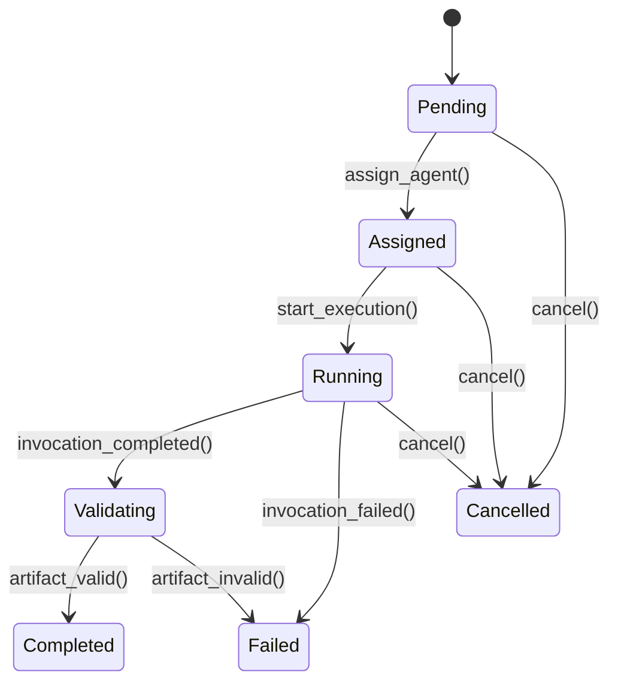
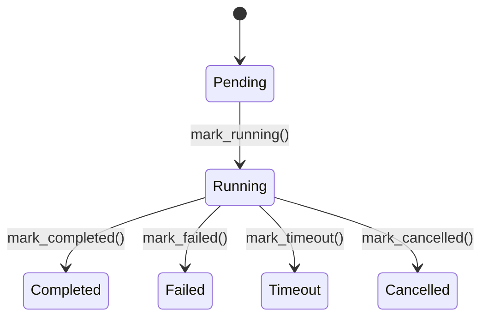
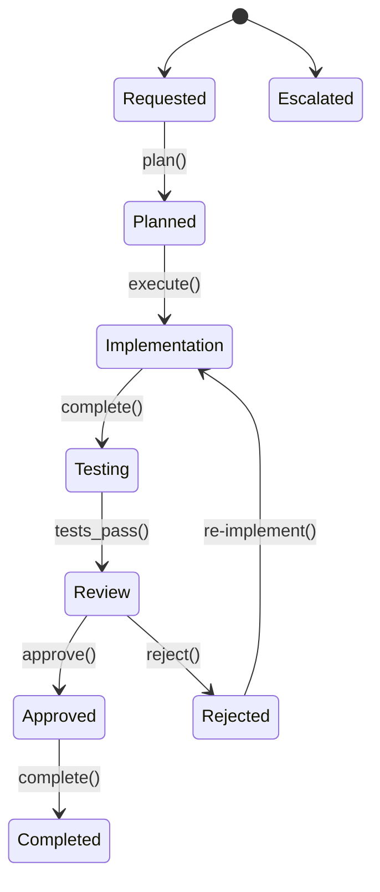

# Domain Model

## Aggregate Ownership and Transactional Boundaries

Each aggregate root owns its invariants and is updated transactionally. Cross-aggregate changes use eventual consistency via domain events.

## Core Aggregates

### TeamDefinition Aggregate (Configuration)

```
TeamDefinition
├── roles: list[RoleRef]
├── agent_bindings: list[AgentBinding]
├── policies: list[PolicyRef]
└── budget: BudgetLimits
```

**Lifecycle**: Draft → Validating → Published → Deprecated → Retired

**Invariants**:
- All referenced roles must exist and be Published
- All agent_bindings must reference valid AgentDefinitions
- Budget limits must be non-negative

### RoleDefinition Aggregate (Configuration)

```
RoleDefinition
├── responsibility: str
├── inputs: list[ContractRef]
├── outputs: list[ContractRef]
├── allowed_actions: list[str]
├── quality_criteria: QualityCriteria
└── required_capabilities: list[CapabilityRequirement]
```

**Lifecycle**: Draft → Validating → Published → Deprecated

**Invariants**:
- All output contracts must be Published
- Required capabilities must be testable

### AgentDefinition Aggregate (Configuration)

```
AgentDefinition
├── adapter_type: AdapterType
├── adapter_config: AdapterConfig
├── capabilities: list[Capability]
├── resource_profile: ResourceLimits
├── security_profile: SecurityProfile
└── health_status: HealthStatus
```

**Lifecycle**: Draft → Validating → Published → Deprecated

**Invariants**:
- If sandbox_required=true, network must be limited
- All capabilities must have valid skill names

### ContractDefinition Aggregate (Configuration)

```
ContractDefinition
├── schema: SchemaDocument
├── version: ContractVersion
├── compatibility_policy: CompatibilityRule
└── validation_rules: list[ValidationRule]
```

**Lifecycle**: Draft → Validating → Published → Deprecated

**Invariants**:
- Schema must be valid JSON/YAML Schema
- Version must follow SemVer
- N-1 minor version compatibility maintained

### Task Aggregate (Execution)

```
Task (Aggregate Root)
├── objective: str
├── assigned_role: str
├── inputs: list[ArtifactRef]
├── expected_outputs: list[ContractType]
├── constraints: dict
├── assignment: Assignment
├── cost_budget: CostBudget
├── status: TaskStatus
├── attempts: int
└── metadata: TaskMetadata
```

**Lifecycle**: Pending → Assigned → Running → Validating → Completed / Failed / Cancelled

**Invariants**:
- Must have Assignment before Running
- Cost budget must not be exceeded
- Expected outputs must have valid ContractDefinitions

### AgentInvocation Aggregate (Execution)

```
AgentInvocation (Aggregate Root)
├── task_id: UUID
├── agent_definition_id: UUID
├── contract_type: str
├── contract_version: str
├── status: InvocationStatus
├── resource_usage: ResourceUsage
└── output_artifact_id: UUID | None
```

**Lifecycle**: Pending → Running → Completed / Failed / Timeout / Cancelled

### Workspace Aggregate (Execution)

```
Workspace (Aggregate Root)
├── repo_url: str
├── branch: str
├── workdir: str
├── ephemeral: bool
└── sandbox_id: UUID | None
```

**Lifecycle**: Created → Active → Cleaned

---

## Entity Relationship Diagram

```
TeamDefinition 1 ──→ * RoleDefinition
TeamDefinition 1 ──→ * AgentDefinition
TeamDefinition 1 ──→ * WorkflowDefinition

RoleDefinition ──→ * Capability (referenced)
AgentDefinition ──→ * Capability (declared)

Task 1 ──→ 1 Workspace
Task 1 ──→ 1..* AgentInvocation (for retries)
Task ──→ * Artifact (outputs)

WorkflowInstance 1 ──→ * Task
WorkflowInstance ──→ * Approval
```

---

## State Machines

### Task States



### AgentInvocation States



### WorkflowInstance States



---

## Capability Matching

Weighted scoring algorithm (skill 50%, language 30%, tool 20%) with configurable thresholds.

---

## Retry Policy

Retry uses the same Workspace to preserve partial progress. Maximum attempts enforced by Task aggregate.